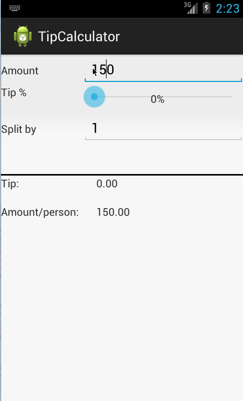

#1 Tip Calculator 

This is an Android utility application that allows user to calculate the appropriate tip based on the total amount entered.

Time spent: 3 Hours in total

Complete User Stories :
-------------------------
*[Required] User is displayed the tip of specified percentage for specified entered amount
*[Required] User enters the total amount of the transaction
*[Required] User can select between tip amounts (i.e 10%, 15%, 20%)- using the slider
*[Required] Upon selecting tip amount, formatted tip value is displayed
*(Optional) User changes the total amount and updated tip is reflected automatically
*(Optional) User can select custom tip percentage if desired
*(Optional) User can select how many ways to split the tip- using the data entered in the Split by

Notes:

Walkthrough of all user stories:

